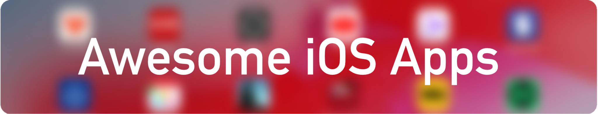

> A curated list of awesome apps for the iOS ecosystem, which includes iPhone ![][iphone], iPad ![][ipad], Watch ![][watch] and TV ![][tv].

> *Apps marked with ![][iap] offer premium features as a one-time in-app purchase. Those marked with ![][subscription] offer premium features with a in-app subscription.*

<!-- START doctoc generated TOC please keep comment here to allow auto update -->
<!-- DON'T EDIT THIS SECTION, INSTEAD RE-RUN doctoc TO UPDATE -->
## Contents

- [Health](#health)
- [Multimedia](#multimedia)
- [Productivity](#productivity)
- [Reading](#reading)
- [Social Media](#social-media)
- [Weather](#weather)
- [Contribute](#contribute)

<!-- END doctoc generated TOC please keep comment here to allow auto update -->

## Health

- [Pillow](https://apps.apple.com/de/app/pillow-automatic-sleep-tracker/id878691772) - Track the quality and duration of your sleep automatically. ![][iphone]![][ipad]![][watch] ![][iap]

## Multimedia

- [Darkroom](https://apps.apple.com/de/app/darkroom-photo-video-editor/id953286746) -  Photo and video editor with an easy to use interface, yet including many powerful tools. ![][iphone]![][ipad] ![][subscription]

- [Infuse 6](https://apps.apple.com/de/app/infuse-6/id1136220934) - Powerful video player and library, that fetches metadata for movies and TV shows automatically. ![][iphone]![][ipad]![][tv] ![][subscription]

- [Overcast](https://apps.apple.com/de/app/overcast/id888422857) - Podcast player for podcast enthusiasts, including powerful features like Smart Speed and Voice Boost. ![][iphone]![][ipad]![][watch] ![][subscription]

- [Pixelmator Photo](https://apps.apple.com/de/app/pixelmator-photo/id1444636541) - Photo editor with powerful tools to adjust your photos. ![][ipad]

## Productivity

- [1Blocker](https://apps.apple.com/de/app/1blocker-for-safari/id1365531024) - Blocking ads and trackers, with many predefined rules and the option to define custom ones. ![][iphone]![][ipad] ![][subscription]

- [1Password](https://apps.apple.com/de/app/1password-password-manager/id568903335) - Beautiful and well integrated password manager. ![][iphone]![][ipad]![][watch] ![][subscription]

- [Bring](https://apps.apple.com/de/app/bring-shopping-list-recipes/id580669177) - Shared shopping lists, with integrated recipes and loyalty cards. ![][iphone]![][ipad]![][watch]

- [Cardhop](https://apps.apple.com/de/app/cardhop/id1448744070) - Contacts manager app on steroids with a powerful natural language parsing engine ![][iphone]![][ipad]

- [Drafts](https://apps.apple.com/de/app/drafts/id1236254471) - Markdown Text-Editor with large directory for automation. ![][iphone]![][ipad]![][subscription]

- [Fantastical](https://flexibits.com/fantastical/download-ios) - Extensive calendar and tasks app with tons of features. ![][iphone]![][ipad]![][watch] ![][subscription]

- [ScanPro](https://apps.apple.com/de/app/scanpro-app-docs-pdf-ocr/id834854351) - Née "Scanbot", fast document scanner with extensive integration of cloud services. ![][iphone]![][ipad] ![][subscription]

- [Supershift](https://itunes.apple.com/app/supershift/id1104165041?mt=8) - Calendar app for managing shift working schedules. ![][iphone]![][ipad]![][watch] ![][iap]

- [Things](https://apps.apple.com/de/app/things-3/id904237743) - Beautiful and simple, yet powerful task manager. ![][iphone]![][watch]
	- [Things for iPad](https://apps.apple.com/de/app/things-3-for-ipad/id904244226) ![][ipad]

## Reading

- [PDF Expert](https://apps.apple.com/de/app/pdf-expert-7-pdf-editor/id743974925) - A  PDF powerhouse on iOS with extensive options for reading, annotating and even editing PDFs. ![][iphone]![][ipad] ![][subscription]

- [Reeder](https://apps.apple.com/de/app/reeder-4/id1449412357) - Elegant feed reader with support for many sync services (including self-hosted ones). ![][iphone]![][ipad]

- [V for Wiki](https://apps.apple.com/de/app/v-for-wikipedia/id993435362) - 
A Wikipedia reader with a focus on great layout and typography. ![][iphone]![][ipad]![][watch]

## Social Media

- [Twitterific](https://apps.apple.com/de/app/twitterrific-tweet-your-way/id580311103) - Elegant and clutter-free Twitter client with many power user features. ![][iphone]![][ipad] ![][subscription]

## Weather

- [Carrot Weather](https://apps.apple.com/de/app/carrot-weather/id961390574) - Weather forecasts presented by a ~~snarky~~ homicidal AI. Featuring various data sources, achievements and hidden locations. ![][iphone]![][ipad]![][watch] ![][subscription]

## Contribute
To truly be awesome, this list needs you! If you know an app that you believe should be on this list, please [contribute](contributing.md).

[iphone]: /media/iphone.svg
[ipad]: /media/ipad.svg
[watch]: /media/watch.svg
[tv]: /media/tv.svg
[subscription]: /media/subscription.svg
[iap]: /media/iap.svg
